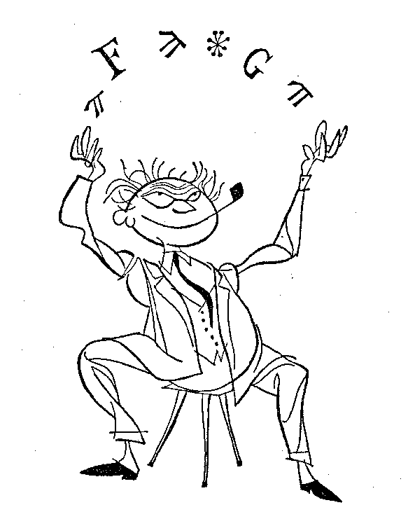
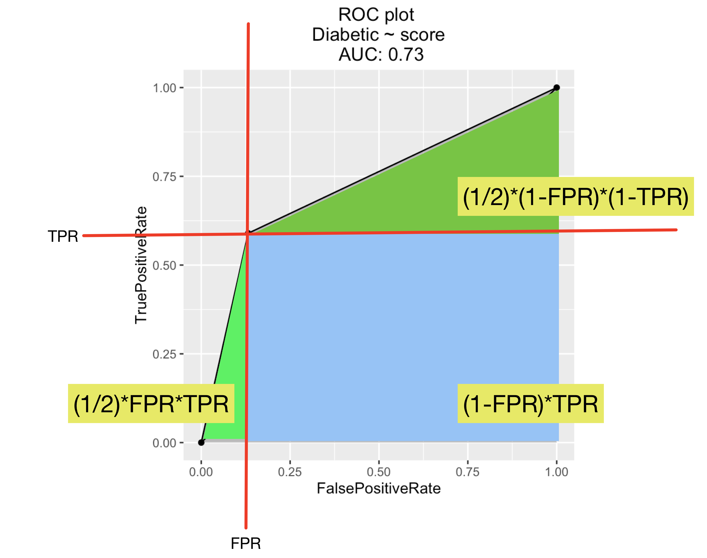

```{r setup, include=FALSE}
knitr::opts_chunk$set(echo = TRUE)
```

Beginning analysts and data scientists often ask: "how does
one remember and master the seemingly endless number of classifier metrics?"

My concrete advice is:

 * Read [Nina Zumel](https://ninazumel.com)'s excellent [series on scoring classifiers](http://www.win-vector.com/blog/2009/11/i-dont-think-that-means-what-you-think-it-means-statistics-to-english-translation-part-1-accuracy-measures/).
 * Keep notes.
 * Settle on one or two metrics as you move project to project.  We prefer "AUC" early in a project (when you want a flexible score) and "deviance" late in a project (when you want a strict score).
 * When working on practical problems work with your business partners to find out which of precision/recall, or sensitivity/specificity most match their business needs.  If you have time show them and explain the ROC plot and invite them to price and pick points along the ROC curve that most fit their business goals.  Finance partners will rapidly recognize the ROC curve as  "the efficient frontier" of classifier performance and be very comfortable working with this summary.
 
That being said it always seems like there is a bit of [gamesmanship](https://en.wikipedia.org/wiki/Gamesmanship) in that somebody always brings up 
yet another score, often apparently in the hope you may not have heard of it.  Some choice of measure
is signaling your pedigree (precision/recall implies a data mining background, sensitivity/specificity a medical science background) and hoping to befuddle others.



The rest of this note is some help
in dealing with this menagerie of common competing classifier evaluation scores.

## Definitions

Lets define our terms.   We are going to work with "binary classification" problems.
These are problems where we have example instances (also called rows) that are either "in
the class" (we will call these instances "true") or not (and we will call these instances "false").
A classifier is a function that given the description of an instance tries to determine if
the instance is in the class or not.  The classifier may either return a decision of "positive"/"negative"
(indicating the classifier thinks the instance is in or out of the class) or a probability score denoting
the estimated probability of being in the class.

## Decision or Hard Classifiers

For decision based (or "hard") classifiers (those returning only a positive/negative determination) 
the "confusion matrix" is a [sufficient statistic](https://en.wikipedia.org/wiki/Sufficient_statistic) in
the sense it contains all of the information summarizing classifier quality.  All other classification measures can be derived from it.

For a decision classifier (one that returns "positive" and "negative", and not probabilities)
the classifier's performance is completely determined by four counts:

 * The True Positive count, this is the number of items that are in the true class that the classifier declares to be positive.
 * The True Negative count, this is the number of items that in the false class that the classifier declares to be negative.
 * The False Positive count, this is the number of items that are not in the true class that the classifier declares to be positive.
 * The False Negative count, this is the number of items in the true class the that classifier declares to be negative.

Notice true and false are being used to indicate if the classifier is correct (and not the actual category of each item) in these terms.  This is traditional nomenclature. The first two quantities are where the classifier is correct (positive corresponding to true and negative corresponding to false) and the second two quantities count instances where the classifier is incorrect.

It is traditional to arrange these quantities into a 2 by 2 table called the confusion matrix.
If we define

```{r def1}
library('ggplot2')
library('caret')
library('rSymPy')
A = Var('TruePositives')
B = Var('FalsePositives')
C = Var('FalseNegatives')
D = Var('TrueNegatives')
```

Then the [caret](http://topepo.github.io/caret/index.html) [R package](https://cran.r-project.org) defines the confusion matrix as follows (see `help("confusionMatrix")`) as follows:

              Reference	
    Predicted	Event	No Event
         Event	A	    B
      No Event	C	    D

Reference is "ground truth" or actual outcome.  We will call examples that have true ground truth "true examples" (again, please don't confuse this with "TrueNegatives" which are "false examples" that are correctly scored as being false.  We would prefer to have the classifier indicate columns instead of rows, but we will use the caret notation for consistency.

We can encode what we have written about these confusion matrix summaries as algebraic statements.
Caret's `help("confusionMatrix")` then gives us definitions of a number of common classifier scores:


```{r algebrasetup}
# (A+C) and (B+D) are facts about the data, independent of classifier.
Sensitivity = A/(A+C)
Specificity = D/(B+D)
Prevalence = (A+C)/(A+B+C+D)
PPV = (Sensitivity * Prevalence)/((Sensitivity*Prevalence) + ((1-Specificity)*(1-Prevalence)))
NPV = (Specificity * (1-Prevalence))/(((1-Sensitivity)*Prevalence) + ((Specificity)*(1-Prevalence)))
DetectionRate = A/(A+B+C+D)
DetectionPrevalence = (A+B)/(A+B+C+D)
BalancedAccuracy = (Sensitivity+Specificity)/2
```

We can (from our notes) also define some more common metrics:

```{r moredefs}
TPR = A/(A+C)     # True Positive Rate
FPR = B/(B+D)     # False Positive Rate
FNR = C/(A+C)     # False Negative Rate
TNR = D/(B+D)     # True Negative Rate
Recall = A/(A+C)
Precision = A/(A+B)
Accuracy = (A+D)/(A+B+C+D)
```

By writing everything down it becomes obvious that`Sensitivity==TPR==Recall`. 
That won't stop somebody from complaining if you say "recall" when they
prefer "sensitivity", but that is how things are.

By declaring all of these quantities as [sympy](http://www.sympy.org/en/index.html) variables and 
expressions we can now check much more.  We confirm formal equality of various measures by checking that their
difference algebraically simplifies to zero.

```{r algebraderivations}
# Confirm TPR == 1 - FNR
sympy(paste("simplify(",TPR-(1-FNR),")"))

# Confirm Recall == Sensitivity
sympy(paste("simplify(",Recall-Sensitivity,")"))

# Confirm PPV == Precision
sympy(paste("simplify(",PPV-Precision,")"))
```

We can also confirm non-identity by simplifying and checking an instance:

```{r noteq}

# Confirm Precision != Specificity
expr <- sympy(paste("simplify(",Precision-Specificity,")"))
print(expr)

sub <- function(expr,
                TruePositives,FalsePositives,FalseNegatives,TrueNegatives) {
  eval(expr)
}

sub(parse(text=expr),
    TruePositives=0,FalsePositives=1,FalseNegatives=0,TrueNegatives=1)
```

## More difficult checks

### Balanced Accuracy

We can denote the probability of a true (in-class) instances scoring higher 
than a false (not in class) instance (with 1/2 point for ties) as
`Prob[score(true)>score(false)] (with half point on ties)`.  We can confirm
`Prob[score(true)>score(false)] (with half point on ties) == BalancedAccuracy` for hard or decision classifiers by defining `score(true)>score(false)` as:

    A D : True Positive and True Negative: Correct sorting 1 point
    A B : True Positive and False Positive (same prediction "Positive", different outcomes): 1/2 point
    C D : False Negative and True Negative (same prediction "Negative", different outcomes): 1/2 point
    C B : False Negative and True Negative: Wrong order 0 points
    
Then `ScoreTrueGTFalse == `Prob[score(true)>score(false)]` is:
   
```{r balancedaccuracy}
ScoreTrueGTFalse = (1*A*D  + 0.5*A*B + 0.5*C*D + 0*C*B)/((A+C)*(B+D))
```

Which we can confirm is equal to balanced accuracy.

```{r ba2}
sympy(paste("simplify(",ScoreTrueGTFalse-BalancedAccuracy,")"))
```

### AUC

We can also confirm `Prob[score(true)>score(false)]` (with half point on ties) == `AUC`.  We can compute the `AUC` (the area under the drawn curve) of the above confusion matrix by referring to the following diagram.



Then we can check for general equality:

```{r auc}
AUC = (1/2)*FPR*TPR + (1/2)*(1-FPR)*(1-TPR) + (1-FPR)*TPR
sympy(paste("simplify(",ScoreTrueGTFalse-AUC,")"))
```

This AUC score (with half point credit on ties) equivalence holds in general (see also [More on ROC/AUC](http://www.win-vector.com/blog/2013/01/more-on-rocauc/), though I got this wrong the first time).

### F1

We can show `F1` is different than Balanced Accuracy by plotting results they differ on:

```{r F1}
# Wikipedia https://en.wikipedia.org/wiki/F1_score
F1 = 2*Precision*Recall/(Precision+Recall)
F1 = sympy(paste("simplify(",F1,")"))
print(F1)
print(BalancedAccuracy)


# Show F1 and BalancedAccuracy do not always vary together (even for hard classifiers)
F1formula = parse(text=F1)
BAformula = parse(text=BalancedAccuracy)
frm = c()
for(TotTrue in 1:5) {
  for(TotFalse in 1:5) {
    for(TruePositives in 0:TotTrue) {
      for(TrueNegatives in 0:TotFalse) {
        FalsePositives = TotFalse-TrueNegatives
        FalseNegatives = TotTrue-TruePositives
        F1a <- sub(F1formula,
                   TruePositives=TruePositives,FalsePositives=FalsePositives,
                   FalseNegatives=FalseNegatives,TrueNegatives=TrueNegatives)
        BAa <- sub(BAformula,
                   TruePositives=TruePositives,FalsePositives=FalsePositives,
                   FalseNegatives=FalseNegatives,TrueNegatives=TrueNegatives)
        if((F1a<=0)&&(BAa>0.5)) {
          stop()
        }
        fi = data.frame(
          TotTrue=TotTrue,
          TotFalse=TotFalse,
          TruePositives=TruePositives,FalsePositives=FalsePositives,
          FalseNegatives=FalseNegatives,TrueNegatives=TrueNegatives,
          F1=F1a,BalancedAccuracy=BAa,
          stringsAsFactors = FALSE)
        frm = rbind(frm,fi) # bad n^2 accumulation
      }
    }
  }
}

ggplot(data=frm,aes(x=F1,y=BalancedAccuracy)) + 
  geom_point() + 
  ggtitle("F1 versus balancedAccuarcy/AUC")
```

## Baroque measures

In various sciences over the years over 20 measures of "scoring correspondence"
have been introduced by playing games with publication priority, symmetry, and incorporating significance
("chance adjustments") directly into the measure.  

Each measure presumably exists because it avoids flaws of all of the others.  However the sheer number
of them (in my opinion) triggers what I call "De Morgan's objection":

>   If I had before me a fly and an elephant, having never seen more than one such magnitude of either kind; and if the fly were to endeavor to persuade me that he was larger than the elephant, I might by possibility be placed in a difficulty. The apparently little creature might use such arguments about the effect of distance, and might appeal to such laws of sight and hearing as I, if unlearned in those things, might be unable wholly to reject. But if there were a thousand flies, all buzzing, to appearance, about the great creature; and, to a fly, declaring, each one for himself, that he was bigger than the quadruped; and all giving different and frequently contradictory reasons; and each one despising and opposing the reasons of the others—I should feel quite at my ease. I should certainly say, My little friends, the case of each one of you is destroyed by the rest. 
>   
>  (Augustus De Morgan, "A Budget of Paradoxes" 1872)


There is actually an excellent literature stream investigating
which of these measures are roughly equivalent (say arbitrary monotone functions of each other)
and which are different (leave aside which are even useful).

Two excellent guides to this rat hole include:

 * Ackerman, M., & Ben-David, S. (2008). "Measures of clustering quality: A working set of axioms for clustering."" Advances in Neural Information Processing Systems: Proceedings of the 2008 Conference.

 * Warrens, M. (2008). "On similarity coefficients for 2× 2 tables and correction for chance." Psychometrika, 73(3), 487–502.
 
The point is: you not only can get a publication trying to sort this mess, you can actually do truly interesting work trying to relate these measures.

## Further directions

One can take finding relations and invariants much further as in ["Lectures on Algebraic Statistics" Mathias Drton, Bernd Sturmfels, Seth Sullivant, 2008](https://math.berkeley.edu/~bernd/owl.pdf).

# Conclusion

It is a bit much to hope to only need to know "one best measure" or to claim to be familiar (let alone
expert) in all plausible measures.  Instead,
find a few common evaluation measures that work well and stick with them.


